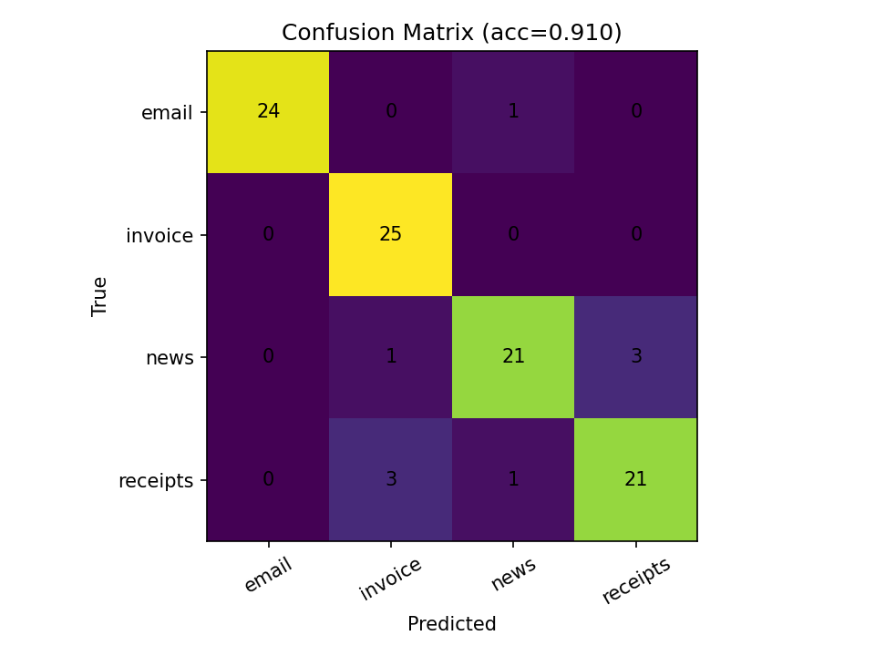

# Image Processing Home Work
OCR pagrindu veikiantis dokumentų analizės projektas, skirtas:
- teksto išgavimui iš vaizdų,
- dokumento tipo klasifikavimui,
- struktūrizuotų laukų ištraukimui,
- rezultatų įrašymui į JSON/CSV bei metrikų generavimui.

---

## 1. Apžvalga

Šis projektas įgyvendina dokumentų apdorojimo pipeline, skirtą skenuotiems ar fotografuotiems dokumentams:
- **email**
- **invoice**
- **news**
- **receipts**

Pipeline tikslas:
1. nuskaityti tekstą iš dokumento vaizdo (OCR),
2. nustatyti dokumento klasę,
3. ištraukti svarbiausius laukus (pvz., invoice number, total amount, subject, date ir pan.),
4. išsaugoti rezultatą struktūrizuotai (`results/json/*.json`),
5. (pasirinktinai) sukurti anotuotą vaizdą su OCR dėžutėmis,
6. batch režime įvertinti kokybę (accuracy, confusion matrix, predictions CSV).

---

## 2. Metodai

### 2.1 OCR sluoksnis
OCR realizuotas su **EasyOCR** (`src/ocr.py`):
- grąžina pilną tekstą (`ocr_text`),
- grąžina aptikimo dėžutes (`boxes`), kurios naudojamos anotacijoms.

### 2.2 Dokumento klasifikacija
Klasifikacija (`src/classifier.py`) veikia dviem režimais:
1. **LLM režimas** (per Ollama, pvz. `phi3`) – kai `use_llm=True`;
2. **Rule-based fallback** – jei LLM nepasiekiamas arba atsakymas netinkamas.

Naudojamos klasės:
- `email`, `invoice`, `news`, `receipts`.

### 2.3 Laukų ištraukimas (Field Extraction)
`src/extractor.py`:
- dokumento tipui pritaikyti promptai,
- „focused text“ strategija mažesniems lokaliems modeliams,
- regex fallback pagal dokumento tipą.

Pavyzdiniai laukai:
- **email**: from, to, cc, subject, date
- **invoice**: invoice_number, date, seller, buyer, total_amount, vat_amount, currency
- **receipts**: store, date, total, currency, payment_method
- **news**: title, author, content

### 2.4 Batch evaluacija
`src/eval.py` generuoja:
- `predictions.csv`
- `summary.txt`
- `confusion_matrix.png`

Papildomai skaičiuojama:
- accuracy,
- bendras ir vidutinis apdorojimo laikas.

---


## 3. Sąranka (Windows)

### 3.1 Reikalavimai
- Windows 10/11
- Python 3.10+ (rekomenduojama 3.11/3.12)
- `pip`
- **Ollama** + modelis `phi3`

### 3.2 Diegimas

Sukurti virtualią aplinką ir įdiegti priklausomybes:

```bash
pip install -r requirements.txt
```

LLM (Ollama):

1) Įdiegti Ollama: https://ollama.com  
2) Parsisiųsti modelį:

```bash
ollama pull phi3
```

Patikrinti, ar modelis atsisiųstas:

```bash
ollama list
```

> Pastaba: LLM režimas naudoja lokalią Ollama API (`http://localhost:11434`). Jei Ollama neveikia, rekomenduojama naudoti `--no-llm`.

---

## 4. Vykdymo instrukcijos

### 4.1 Vieno failo apdorojimas

Bazinė komanda:

```bash
python main.py dataset/invoice/batch1-1024.jpg
```

Naudingi argumentai:
- `--outdir results` – kur saugoti output
- `--model phi3` – Ollama modelis, modelio pakeitimui
- `--lang en` – OCR kalba (pvz. `en`, `lt`, `en+lt`)
- `--annotate` – išsaugoti OCR dėžučių anotuotą vaizdą

Pavyzdys:

```bash
python main.py dataset/invoice/batch1-0002.jpg --annotate
```

### 4.2 Batch režimas

Su limitu (testavimui):

```bash
python main.py --batch dataset --limit 50
```

---
## 5. Rezultatai ir output struktūra

Po paleidimo visi sugeneruoti rezultatai saugomi `results/` kataloge.

### 5.1 Katalogai ir failai

- `results/json/*.json` – pagrindinė išvestis: struktūrizuotas JSON kiekvienam apdorotam dokumentui.
- `results/annotated_images/*_boxes.jpg` – anotuoti vaizdai su OCR aptikimo dėžutėmis (generuojama tik naudojant `--annotate`).
- `results/metrics/predictions.csv` – batch režimo klasifikacijos rezultatai (true vs predicted kiekvienam failui).
- `results/metrics/summary.txt` – batch suvestinė (accuracy ir laiko statistika).
- `results/metrics/confusion_matrix.png` – klaidų matrica (confusion matrix) grafikas.

### 5.2 JSON struktūra

Kiekvienas JSON failas turi šiuos pagrindinius laukus:

- `document_type` – nustatytas dokumento tipas (`email`, `invoice`, `news`, `receipts`).
- `fields` – ištraukti struktūrizuoti laukai (dinaminiai; priklauso nuo dokumento tipo).
- `ocr_text` – OCR išgautas tekstas (gali būti ilgas, ypač invoice/news).
- `meta` – techninė informacija apie apdorojimą (OCR variklis, metodas, confidence, laikai ir kt.).

### 5.3 JSON pavyzdys (invoice)

Programa sugeneruoja JSON failą į `results/json/<failas>.json`. Žemiau pateikiamas pavyzdys invoice tipo dokumentui:

```json
{
  "document_type": "invoice",
  "fields": {
    "invoice_number": "29593215",
    "date_of_issue": "11/20/2017",
    "seller": null,
    "client": "Hooper Group Washington, Robertson and Howard 41872 Reid Stream North Richardtown, WV 79696 New Jennifer MN 93902 Tax Id: 959-77-0149",
    "tax_ids": [
      "959-77-0149",
      "961-86-4018"
    ],
    "iban": null,
    "items": [
      {
        "item_number": 1,
        "description": "NWT Modcloth Blue Floral",
        "quantity": 3,
        "unit_measurement": "each",
        "net_price": "65.00"
      },
      {
        "item_number": 2,
        "description": "Formal Full Length Maxi Dress Grace Karin Christmas dress Red Black size Large sleeveless",
        "quantity": 3,
        "unit_measurement": "each",
        "net_price": "4.99"
      },
      {
        "item_number": 3,
        "description": "Orange Short Dress NWT Papaya Floral dress Medium",
        "quantity": 1,
        "unit_measurement": "each",
        "net_price": "9.00"
      },
      {
        "item_number": 4,
        "description": "Blue White Women Black Dress Mori Girl",
        "quantity": 5,
        "unit_measurement": "each",
        "net_price": "13.99"
      },
      {
        "item_number": 5,
        "description": "Puff Sleeve Korean Casual Loose Peter Pan Collar sleeveless dress size 6",
        "quantity": 4,
        "unit_measurement": "each",
        "net_price": "3.99"
      }
    ],
    "vat_percentage": 10,
    "gross_worth": null,
    "total_amounts": {
      "subtotal": "$420.88",
      "tax": "$42.09",
      "grand_total": "$462.97"
    }
  },
  "ocr_text": "Invoice ...",
  "meta": {
    "source_image": "dataset\\invoice\\batch1-1028.jpg",
    "classification_confidence": 1.0,
    "classification_method": "llm",
    "ocr_engine": "easyocr",
    "processing_time_seconds": 127.445,
    "ocr_time_seconds": 11.635,
    "classification_time_seconds": 31.243,
    "extraction_time_seconds": 84.566
  }
}
```
---

## 6. Žinomos problemos

1. Praktinis apribojimas: šiuo metu sprendimas stabiliai veikia tik su `.jpg` failais.  
   Nors kode yra platesnis formatų sąrašas, realiame naudojime rekomenduojama naudoti JPG įvestis.
2. LLM režimas priklauso nuo Ollama prieinamumo; jam neveikiant pereinama į fallback taisykles.
3. Batch režimas su LLM gali būti lėtas (ypač CPU aplinkoje).
4. `invoice` ir `receipts` klasės gali persidengti triukšminguose ar trumpuose dokumentuose.
5. OCR kokybė smarkiai priklauso nuo vaizdo kokybės (pasukimas, blur, mažas kontrastas).

## 7. Eksperimento rezultatai

Šiame eksperimente buvo paleistas **batch** režimas su 100 paveikslų (4 klasės: `email`, `invoice`, `news`, `receipts`), sugeneruojant `predictions.csv`, `summary.txt` ir `confusion_matrix.png`.

### 7.1 Bendri rezultatai

- Vaizdų skaičius: **100**
- Accuracy: **0.910**
- `results/metrics/summary.txt` taip pat pateikia laiko statistiką.
  
### 7.2 Confusion matrix

Žemiau pateikiama klaidų matrica (True vs Predicted):



Iš jos matyti:
- `invoice` klasė atpažįstama labai tiksliai (**25/25** teisingai).
- `email` beveik idealiai (**24/25**), viena klaida nukrypo į `news`.
- Daugiausia klaidų tarp `news` ir `receipts`:
  - `news → receipts`: **3** atvejai
  - `receipts → invoice`: **3** atvejai
  - `receipts → news`: **1** atvejis
  - `news → invoice`: **1** atvejis

Interpretacija: `news` ir `receipts` kartais turi panašių trumpų/triukšmingų OCR ištraukų (antraštės, sumos, fragmentai), todėl modelis supainioja dokumento tipą.

### 7.3 Veikimo greitis (batch)

Pagal `summary.txt`:

- Total batch time: **11958.92 s**
- Average per image: **119.536 s**
- Min time: **33.318 s**
- Max time: **274.268 s** 

Pastaba: Batch režimas su LLM CPU aplinkoje gali būti lėtas; greitį galima pagerinti:
- trumpinant LLM įvesties tekstą (focused text strategija),
- arba naudojant spartesnį modelį / GPU.

---
